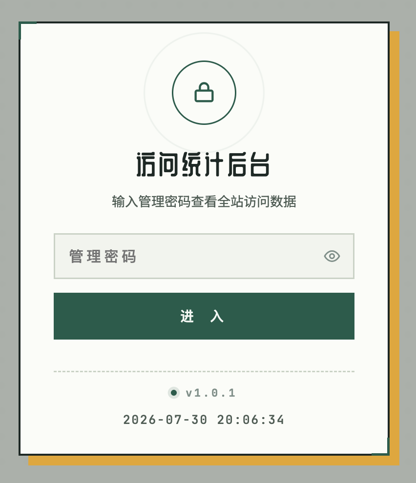
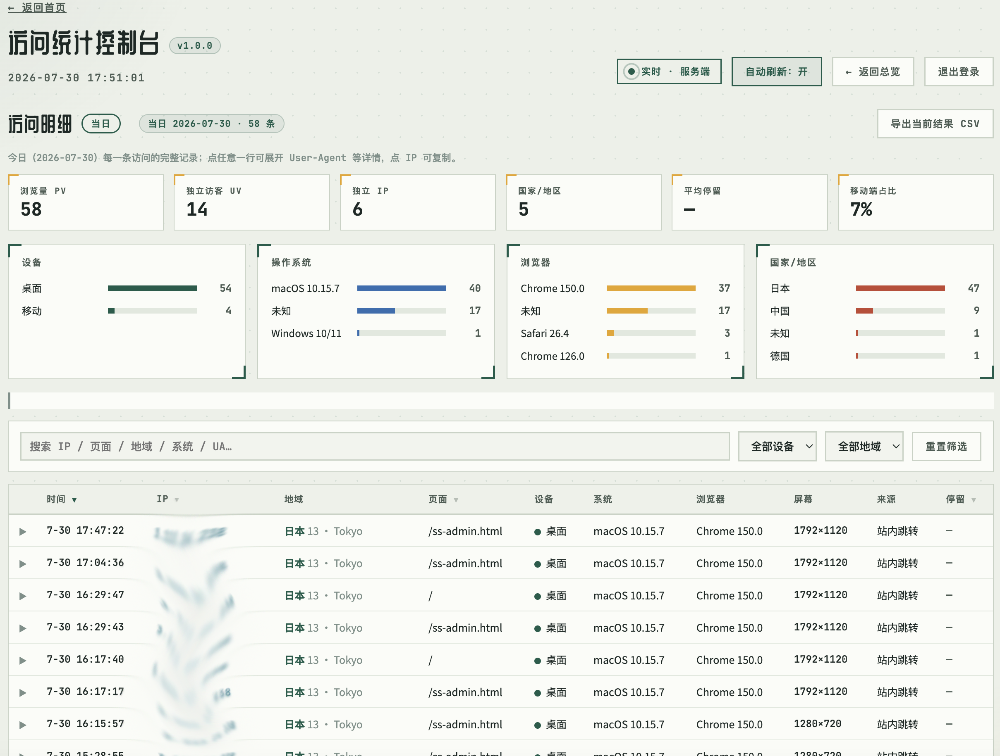
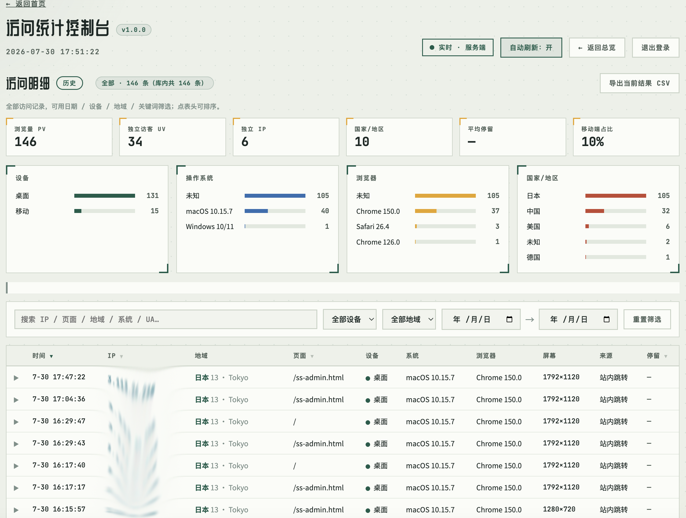

# SiteStats · 轻量可复用站点访问统计


UI界面：




设计说明：
> 零第三方服务、可整体搬运的访问统计组件。**一行命令远程安装**，无需下载；
> 智能安装器自动探测环境、协商端口、配置 nginx、自检全链路；
> 从仪表盘一路下探到每一条访问的 IP 与 User-Agent。数据自持、密码自管、版本可控。

```
 访客浏览器                 你的服务器
 ┌──────────┐  POST /api/ss/report   ┌──────────────────────┐
 │  ss.js   │ ─────────────────────▶ │  nginx  location ^~  │
 │ 自动上报  │   (含 UA / 设备 / 屏幕) │  /api/ss/  (最高优先) │
 └──────────┘                        └──────────┬───────────┘
      ▲ 整页加载 + SPA 路由自动统计              │ proxy :3881
      │                                          ▼
      │  GET /api/ss/summary         ┌──────────────────────┐
      └────────────────────────────  │  stats.mjs (Express) │
        首页挂件(仅数字,不含明细)      │  · 服务端补 IP/地域    │
                                     │  · UA→系统/浏览器      │
                                     │  · 落盘 server/data/  │
                                     └──────────┬───────────┘
                          ┌─────────────────────┼─────────────────────┐
                          ▼                     ▼                     ▼
                  visits.json            auth.json            ss-admin.html
                  访问明细+IP            后台密码哈希          仪表盘 + 明细钻取
                  (仅登录后台可见)        (全设备通用)          (15s 自动刷新 · 显示版本)
```

## 特性

**采集与识别**
- 🌐 **真实 IP**：服务端从 `X-Forwarded-For` 取真实地址；`STORE_IP=false` 一键切回"不存 IP"
- 🗺️ **三级地域**：离线 GeoIP → 国家 / 省 / 市，中国细化到省市
- 🖥️ **设备指纹**：UA 解析操作系统与浏览器（含版本，识别微信/夸克/UC 等）
- 🔁 **SPA 自动统计**：拦截 `pushState/replaceState` + `popstate`，单页应用只嵌一行

**后台与钻取**
- 📊 **仪表盘**：PV/UV、来源、设备、24h 时段、停留、热门页面、地域聚合，15 秒自动刷新
- 🔍 **明细钻取**：「当日 / 历史明细」下探到每条访问——IP（点击复制）、国家·省·市、系统、浏览器、屏幕、来源、停留；排序、搜索、筛选、行展开看完整 UA、分页、CSV 导出
- 👁️ **登录体验**：密码框眼睛图标；服务端密码鉴权，一个密码全设备通用

**工程**
- ⚡ **远程一键安装**：`curl … | bash` 直接装，无需 clone（引导脚本自动拉取仓库 + 调用安装器）
- 🤖 **智能安装器**：探测环境/端口/webroot/nginx，自动插埋点，可选自动配 nginx（备份+校验+回滚），装完自检
- 🏷️ **版本管理**：版本号单一源（`package.json`），后台标题旁实时显示，git tag 存档
- 🔌 **接口隔离**：`/api/ss/` 用 `location ^~` 最高优先级，永不与项目 `/api/` 冲突
- 📦 **数据落盘 JSON**：备份只需拷目录；提供 JSON/CSV 导出

## 目录结构

```
sitestats/
├─ install.sh              ★ 远程一键安装引导脚本（curl | bash 入口）
├─ install.py              ★ 智能安装 / 迁移 / 自检脚本
├─ release.sh              发版脚本（读版本号 → 打 tag → 推送）
├─ package.json            版本单一源（version 字段）
├─ server/
│  ├─ stats.mjs            统计服务端（端口 3881，前缀 /api/ss/）
│  └─ data/                运行后自动生成（visits.json / auth.json，已 gitignore）
├─ public/
│  ├─ ss.js                前端埋点（自动上报 + SPA 路由 + 聚合函数）
│  └─ ss-admin.html        统计后台（仪表盘 + 明细钻取 + 版本徽章）
├─ nginx-sitestats.conf    nginx 接入片段
├─ examples/
│  └─ widget.html          可选：首页"今日访问"挂件
├─ .gitignore
└─ README.md
```

## ⚡ 远程一键安装（推荐，无需下载）

```bash
curl -fsSL https://raw.githubusercontent.com/hardwin2023/sitestats/main/install.sh | bash
```

引导脚本会自动从 GitHub 拉取仓库（**无需装 git**），再交给智能安装器分步引导。常用变体：

```bash
# 无人值守（CI / 脚本），装到 /opt/sitestats 需 root
curl -fsSL https://raw.githubusercontent.com/hardwin2023/sitestats/main/install.sh | sudo bash -s -- --yes --pm2

# 装到指定稳定版本（默认装 main 最新）
curl -fsSL https://raw.githubusercontent.com/hardwin2023/sitestats/main/install.sh | sudo env SITESTATS_VERSION=v1.0.0 bash

# 装到家目录（无需 root；nginx 仍需自行 sudo 配置）
curl -fsSL https://raw.githubusercontent.com/hardwin2023/sitestats/main/install.sh | env SITESTATS_DIR=$HOME/.sitestats bash
```

## 一条命令接入（已下载仓库时）

```bash
python3 install.py
```

安装器分步引导并自动完成：探测 Node/nginx/网站根目录 → 协商端口 → 装依赖 → 部署 `ss.js`/`ss-admin.html` →
**替你插好埋点那一行** → 启动服务 →（可选）自动配 nginx → **健康自检并给出 ✅/❌ 报告**。

> 本组件对"易用"的理解：自托管统计物理上需要一个接收数据的后端，安装器的价值是把这一次性成本压到"回车几下"，
> 并**连页面那一行 JS 都替你挂好**——于是从你的视角，真的只剩"打开后台改个密码"。

常用模式：

```bash
python3 install.py --yes --webroot /var/www/html --pm2   # 无人值守
python3 install.py --auto-nginx                          # 自动配 nginx（备份+校验+回滚）
python3 install.py --check                               # 只读自检，不改任何东西
python3 install.py --import-data /旧路径/sitestats/server/data --pm2   # 迁移数据与密码
```

| 参数 | 说明 | 默认 |
|---|---|---|
| `--webroot` | 网站根目录 | 自动探测 + 交互选择 |
| `--embed` | 嵌入埋点的页面（逗号分隔多个） | 交互 / `index.html` |
| `--port` | 统计端口 | 自动协商（默认 `3881`，被占顺延） |
| `--pm2` / `--no-pm2` | 是否用 pm2 常驻 | 探测后询问 |
| `--name` | pm2 进程名 | `sitestats` |
| `--import-data` | 旧 `server/data` 目录 | 无 |
| `--auto-nginx` | 自动配 nginx（备份+校验+回滚） | 关 |
| `--yes` | 非交互 | 关 |
| `--check` | 只读健康自检 | 关 |

### 安装器替你想到的事（= 我们踩过的坑）

- **端口被占**：先判断"是不是自己已在跑"（升级→沿用），否则自动找空闲端口并同步改 nginx 片段。
- **不知道根目录**：解析 nginx `root` + 扫描常见路径，列出候选（含 `index.html` 的优先）。
- **`www` 漏配**：用 `nginx -T` 列出每个配置文件的每个 server 块，`--auto-nginx` 给它们**全部**插入。
- **重复块翻车**：自动插入前**逐块查重**，已配则跳过，绝不产生 `duplicate location`。
- **改坏配置**：自动插入**先备份**、**改后 `nginx -t`**、**失败自动回滚**。
- **装完没底**：结束自动 curl 服务 + 检查文件 + 检查埋点 + 检查 nginx，给带框报告。

## 不用安装器：手动挂接（4 步）

> 对"要统计的页面"而言，真正要做的只有第 4 步那一行 `<script>`，其余都是服务器侧一次性配置。

1. **启动服务**：`cd sitestats && npm install && pm2 start server/stats.mjs --name sitestats && pm2 save`（默认 `:3881`，改端口用 `SS_PORT=xxxx`）
2. **复制静态文件**：`cp public/ss.js public/ss-admin.html /你的网站根目录/`
3. **配置 nginx**：每个 server 块顶部加入下面片段，`nginx -t && systemctl reload nginx`
4. **页面挂一行 JS**：在 `<head>` 加 `<script src="/ss.js" defer></script>` —— **就这一行**，自执行、SPA 路由自动统计

```nginx
location ^~ /api/ss/ {
    proxy_pass http://127.0.0.1:3881;
    proxy_http_version 1.1;
    proxy_set_header Host $host;
    proxy_set_header X-Real-IP $remote_addr;
    proxy_set_header X-Forwarded-For $proxy_add_x_forwarded_for;   # ← 真实 IP 的关键
    proxy_set_header X-Forwarded-Proto $scheme;
}
location = /ss.js { add_header Cache-Control "no-cache"; try_files $uri =404; }
location = /ss-admin.html { add_header Cache-Control "no-cache"; try_files $uri =404; }
```

> 多域名（含 `www`）**每个 server 块各粘一份**——少粘一个，那个域名上报就 404。完整片段见 `nginx-sitestats.conf`。

## 后台与明细视图

- 地址：`https://你的域名/ss-admin.html`，默认密码 **`admin123`**（登录后立即修改，全设备通用）。标题旁显示当前版本徽章。
- **仪表盘**：默认视图，15 秒自动刷新。
- **当日 / 历史明细**：6 张统计卡 + 4 组分布条（设备/系统/浏览器/国家）+ 明细表（IP 点击复制、地域三级、行展开看完整 UA）；排序、搜索、筛选、分页、CSV 导出。
- 登录框眼睛图标显隐密码。

> IP / 城市 / 系统 / 浏览器仅对**改字段后**的新访问完整；旧记录优雅降级为"—"。

## 需要访客数据的页面加入统计

| 组件 | 作用 | 是否必须 |
|---|---|---|
| `ss.js` | 采集访问数据 | **必须**（不插则该页面不被统计） |
| `widget.html` | 右下角"今日 N 次"胶囊 | 可选（只读不采，须先插 `ss.js`） |

在要统计的页面 `</head>` 前加入一行：

```html
<script src="/ss.js" defer></script>
```

- **多页站点**：每个要统计的页面各加一次；**单页应用(SPA)**：加一次即可。
- **不要胶囊也要插 `ss.js`**——胶囊只是展示，统计靠它。
- 想要胶囊：把 `examples/widget.html` 整段贴到 `</body>` 前。
## 接口（前缀 `/api/ss/`）

| 方法 | 路径 | 鉴权 | 说明 |
|---|---|---|---|
| POST | `/report` | 公开 | 上报；服务端补 IP / 国家·省·市 / 系统 / 浏览器 |
| POST | `/stay` | 公开 | 回写停留时长 |
| GET | `/summary` | 公开 | 仅汇总数字（供挂件） |
| GET | `/version` | 公开 | 版本号（单一源 `package.json`） |
| POST | `/login` | 公开 | 密码换令牌 |
| POST | `/logout` | 公开 | 注销令牌 |
| POST | `/password` | 令牌 | 改密码 |
| GET | `/visits?token=` | 令牌 | 全部记录（明细数据源） |
| POST | `/seed?token=` | 令牌 | 30 天演示数据 |
| POST | `/clear?token=` | 令牌 | 清空 |

## 配置（`server/stats.mjs` 顶部）

| 项 | 默认 | 说明 |
|---|---|---|
| `PORT` / `SS_PORT` | `3881` | 需与 nginx `proxy_pass` 一致 |
| `STORE_IP` | `true` | 设 `false` 则不存 IP（明细 IP 列显示"—"） |
| `MAX` | `20000` | 记录上限，超出丢弃最旧 |
| `TOKEN_TTL` | 12 小时 | 过期 / 重启需重新登录 |
| 默认密码 | `admin123` | 首次运行写入 `auth.json`，后台可改 |

## 版本与发版

版本号**单一源** = `package.json` 的 `version` 字段。服务端启动时读它、经 `/api/ss/version` 暴露、后台标题旁实时显示——**改一处，处处同步**。

迭代发版流程：

```bash
# 1. 改 package.json 的 version（如 1.0.0 → 1.1.0），改完代码
# 2. 提交
git add -A && git commit -m "feat: 你的更新说明"
git push
# 3. 打 tag 并推送（脚本自动从 package.json 读版本号）
./release.sh
# 4. 去 GitHub 基于新 tag 创建 Release，写几句更新说明
```

远程安装指定版本：`SITESTATS_VERSION=v1.1.0`（见"远程一键安装"）。

## 数据与备份（⚠️ 读过能避坑）

统计数据与密码在 **`server/data/`**（是 `server/` 下的 `data`，**不是**模块根的 `data`）：`visits.json`、`auth.json`。

```bash
#!/bin/bash
mkdir -p /root/backup
tar czf "/root/backup/site-$(date +%F).tar.gz" -C / \
    opt/sitestats/server/data \
    var/www/html/server/data        # 你的项目后端数据若在此则一并备份，否则删掉这行
```

> 🩸 **真实踩坑**：曾把路径写成 `opt/sitestats/data`（少了 `server/`），每周"备份"打包的是废弃空目录，真数据从未被备份。**写完后 `tar -tzf 包名` 核对清单**，看到 `visits.json`/`auth.json` 才算数。
> 🩸 **另一条**：清理旧文件时，绝不对承载其它服务数据的目录用 `rm -rf`——先 `ls` 看清里面住着谁。

恢复：`tar xzf /root/backup/site-YYYY-MM-DD.tar.gz -C /`（解回前先 `cp -r` 留底），再 `pm2 restart sitestats`。

## 运维

```bash
pm2 start server/stats.mjs --name sitestats && pm2 save && pm2 startup
pm2 logs sitestats             # 启动行会打印 v版本号 与 STORE_IP
python3 install.py --check     # 随时自检全链路
```

## 复用到其他项目（清单）

1. [ ] 一行 `curl … | bash`（或复制整个 `sitestats/` 到目标服务器，跑 `python3 install.py`）
2. [ ] 看安装报告全 ✅；未用 `--auto-nginx` 则按报告粘 nginx 片段并 reload
3. [ ] 访问 `/ss-admin.html`，用 `admin123` 登录后**立即改密码**
4. [ ] 可选：贴 `examples/widget.html` 到 `</body>` 前
5. [ ] 配好备份脚本，`tar -tzf` 核对一次

## License

MIT